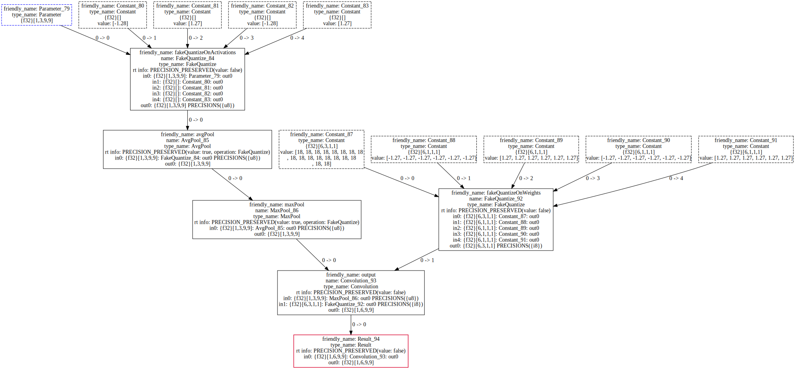
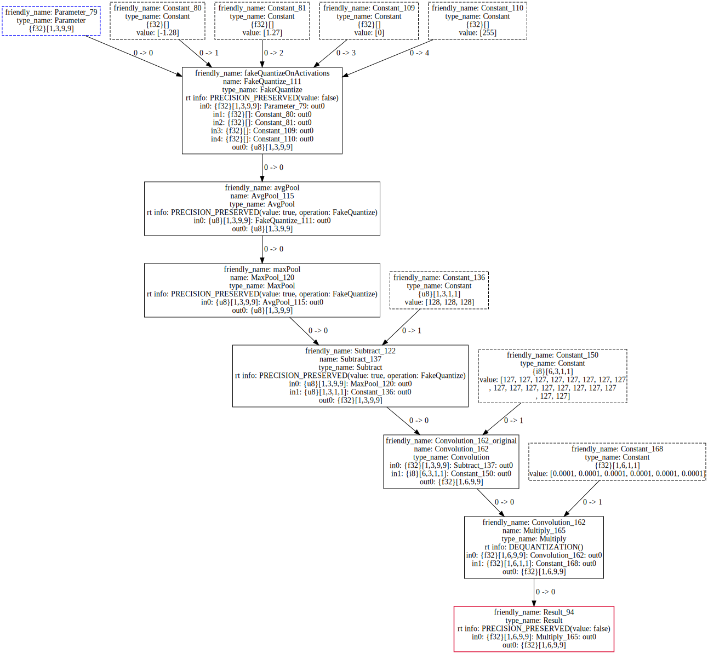

# OpenVINO™ Low Precision Transformations: FakeQuantizeDecompositionTransformation pipelines
## Table of Contents
1. [Introduction](#introduction)
2. [Pipeline #1](#pipeline-1)

## Introduction
`FakeQuantizeDecompositionTransformation` decomposes `FakeQuantize` operation on quantize (`FakeQuantize` with low precision output) and dequantization operations (`Convert`, `Subtract` and `Multiply`). `FakeQuantize` result output precision depends on:
1. Next operation supported input precision. Customizable parameter `precisionsOnActivations` is used for identifying supported input precision.
2. Operation output intervals.

## Pipeline #1
Features:
1. `FakeQuantize` on activations operation output intervals are signed, default precision should be `signed int8` which is not supported by `Convolution` bellow.
2. Quantize and dequantize operations on activations are presented by one `Fakequantize` operation. 
3. Quantize and dequantize operations on weights are presented by one `Fakequantize` operation.
4.  There is no `FakeQuantize` between `AvgPool` and `Convolution`.
5. `Convolution` weights are quantized.

### Original model

### Markup precisions

### Markup AvgPool precisions (CPU/GPU specific)

### Propagate precisions

### Transformations

