# OpenVINO™ Low Precision Transformations: FakeQuantizeDecompositionTransformation pipelines
## Table of Contents
1. [Introduction](#introduction)
2. [Pipeline #1: FakeQuantize decomposition](#pipeline-1-fakequantize-decomposition)
3. [Pipeline #2: Concat per-tensor quantization](#pipeline-2-concat-per-tensor-quantization)
4. [Pipeline #3: Concat multi-channels quantization](#pipeline-3-concat-multi-channels-quantization)
5. [Pipeline #4: FakeQuantize connects neighbor cascade Concat operations](#pipeline-4-fakequantize-connects-neighbor-cascade-concat-operations)

## Introduction
`FakeQuantizeDecompositionTransformation` decomposes `FakeQuantize` operation on quantize (`FakeQuantize` with low precision output) and dequantization operations (`Convert`, `Subtract` and `Multiply`). `FakeQuantize` result output precision depends on:
1. Next operation supported input precision. Customizable parameter `precisionsOnActivations` is used for identifying supported input precision.
2. Operation output intervals.

## Pipeline #1: FakeQuantize decomposition
Features:
1. `FakeQuantize` on activations operation output intervals are signed, default precision should be `signed int8` which is not supported by `Convolution` bellow.
2. Quantize and dequantize operations on activations are presented by one `Fakequantize` operation. 
3. Quantize and dequantize operations on weights are presented by one `Fakequantize` operation.
4.  There is no `FakeQuantize` between `AvgPool` and `Convolution`.
5. `Convolution` weights are quantized.

> TODO: if `Convolution` is not quantized then [[input] port] requirements are not set. <= WIP  
> TODO: if operation is not precision preserved then `PRECISION_PRESERVED` attribute can be skipped. <= WIP: right now: created everywhere

### Original model

### Markup precisions
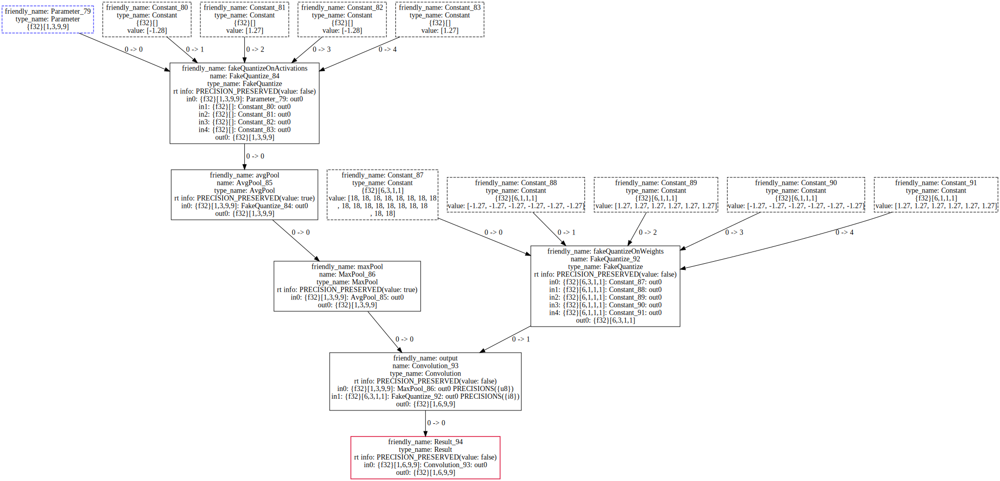

### Markup AvgPool precisions (CPU/GPU specific)

### Propagate precisions

### Transformations

## Pipeline #2: Concat per-tensor quantization
Features:
1. `FakeQuantize` on activations operations output intervals are signed, default precision should be `signed int8` which is not supported by `Convolution` bellow.
2. `FakeQuantize` on activations operations have different output intervals which will be aligned.
3. Quantize and dequantize operations on activations are presented by one `Fakequantize` operation. 
4. Quantize and dequantize operations on weights are presented by one `Fakequantize` operation.
5.  There is no `FakeQuantize` between `AvgPool` and `Convolution`.
6. `Convolution` weights are quantized.

> TODO: `Convolution` operation defines `ConcatTransformation` behavior for each plugin and the behavior is not configurable.

> TODO: if `Convolution` is not quantized then `FakeQuantize` are not aligned <= WIP: `MarkupPrecisions` tranformation checks each operation quantization and add empty [input [port]] requirements if operation is not quantized.  
> TODO: if `ConvolutionTransformation` is skipped ([input [port]] requirements are empty) then `FakeQuantize` are not aligned <= WIP  
> TODO: if `Convolution` operation doesn't exist then `FakeQuantize` are not aligned <= WIP

### Original model
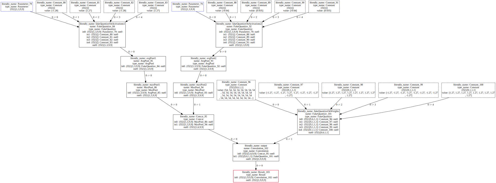

### Markup precisions

### Markup AvgPool precisions (CPU/GPU specific)
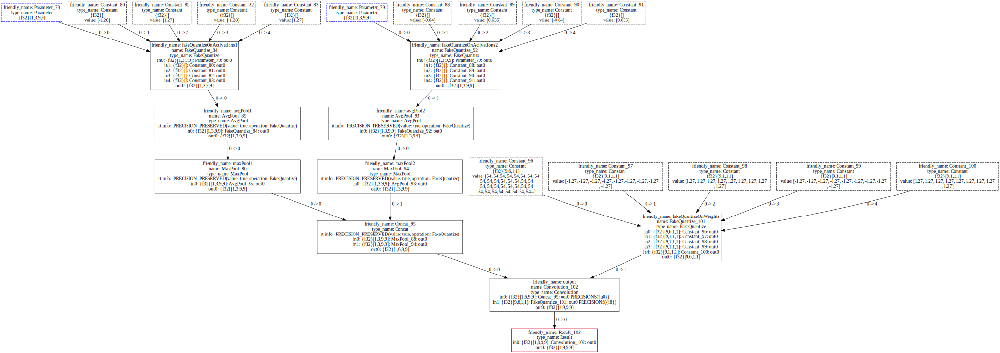

### Propagate precisions
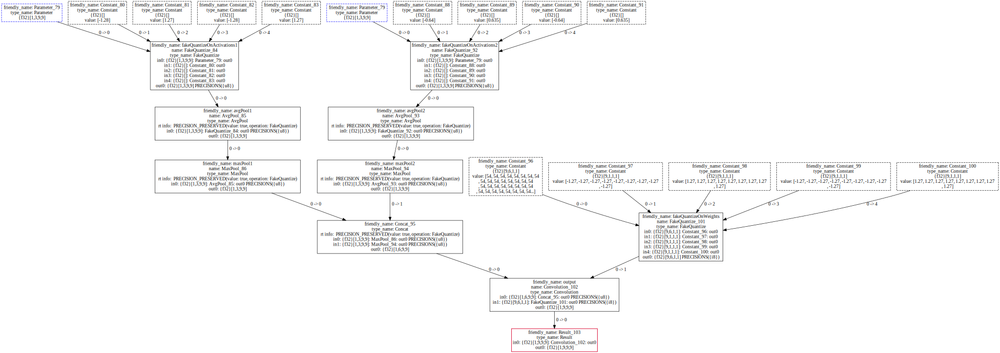

### Align concatization quantization
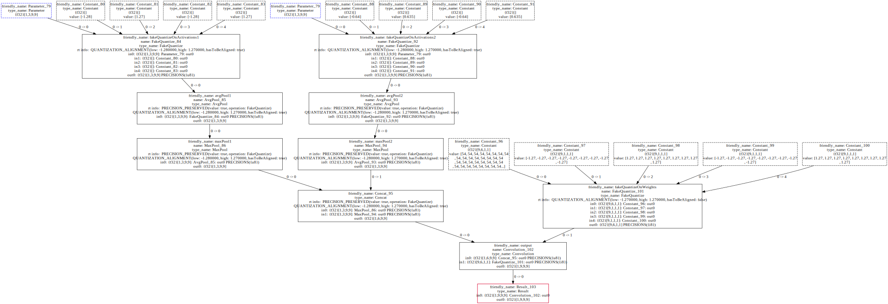

### Transformations
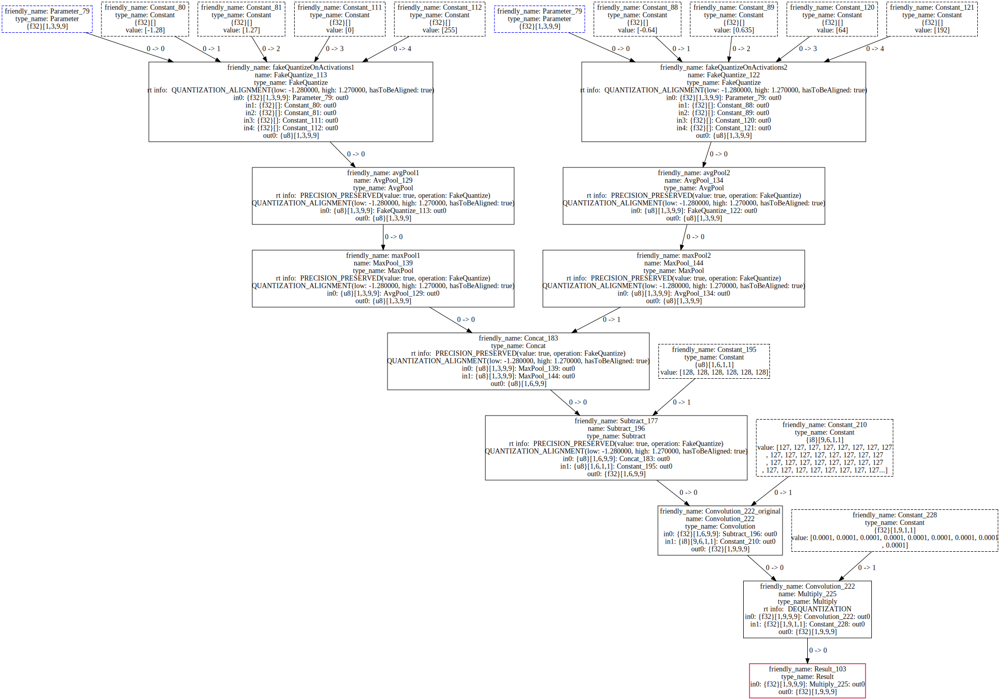

## Pipeline #3: Concat multi-channels quantization
Features:
1. Quantize and dequantize operations on activations are presented by one `Fakequantize` operation. 
2. There is no `FakeQuantize` between `AvgPool` and `Result`.

### Original model
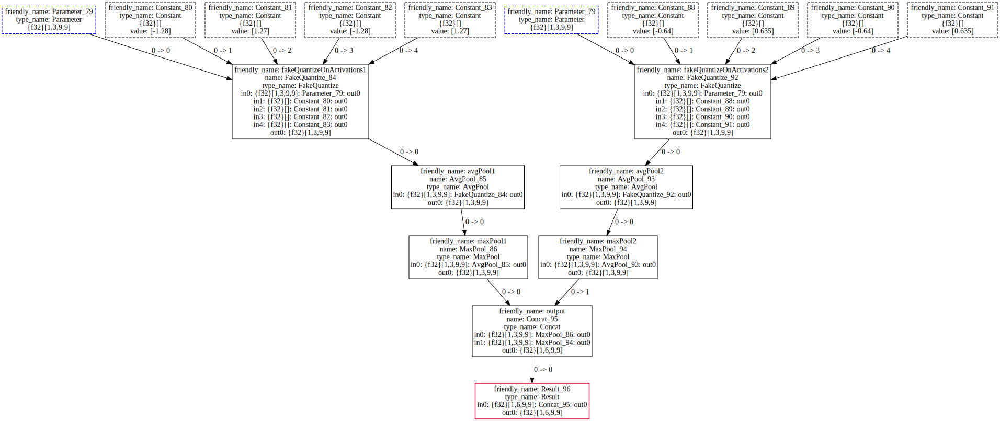

### Markup precisions
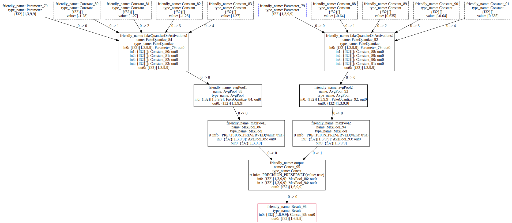

### Markup AvgPool precisions (CPU/GPU specific)
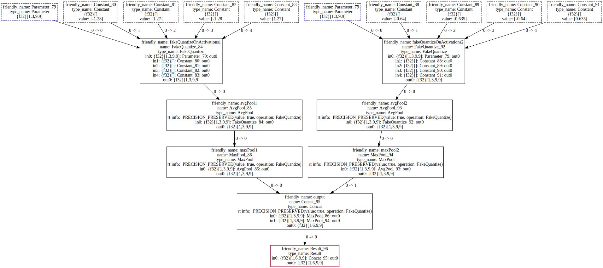

### Propagate precisions

### Align concatization quantization
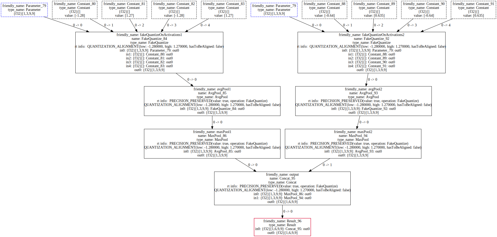

### Transformations
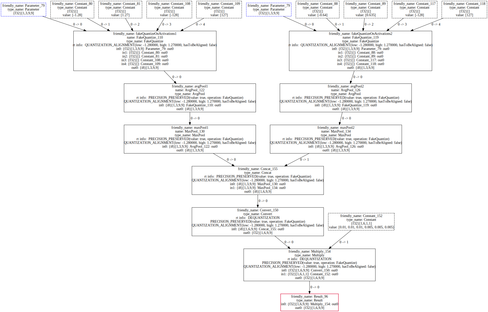

## Pipeline #4: FakeQuantize connects neighbor cascade Concat operations
Features:
1. Quantize and dequantize operations on activations are presented by one `Fakequantize` operation. 
2. There is `FakeQuantize` between two `Concat` subgraphs. The first is multi-channel, the second is per-tensor.

### Original model

### Markup precisions

### Markup AvgPool precisions (CPU/GPU specific)

### Propagate precisions

### Align concatization quantization

### Transformations
